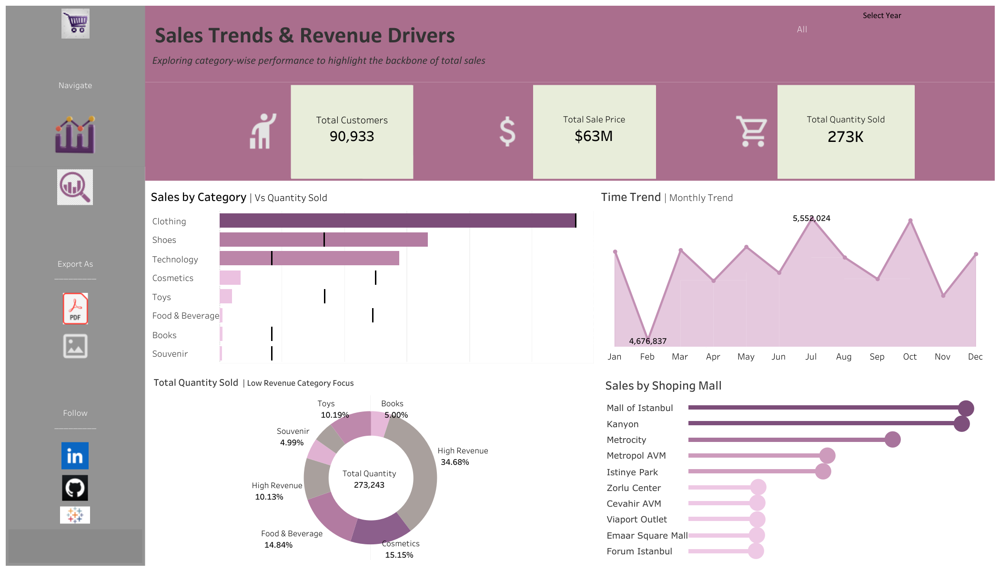
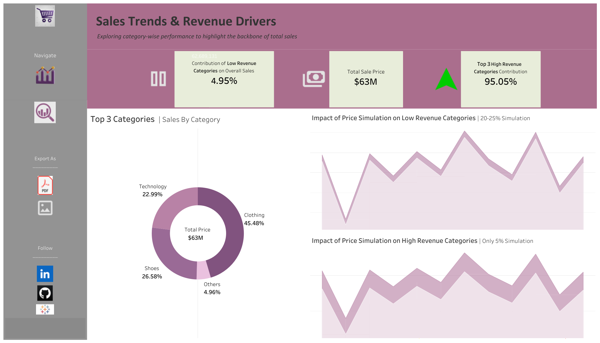

# Sales-Analysis-Revenue-Drivers
**Tableau BI Project | SQL Data Processing**

---

##  Executive Insight
My analysis reveals a significant **Revenue Leverage Effect**. While 'Low Revenue' categories (Books, Toys, etc.) have high transaction volumes, they are price-inelastic. A **5% price simulation** on the 'Top 3' categories (Clothing, Shoes, Technology) generates more revenue growth than a **25% hike** on all other categories combined.

##  Deliverables
*  ****
*  ****   or
*  **[View Interactive Tableau Dashboard](https://public.tableau.com/app/profile/maria.aslam/vizzes)**

---

## Technical Stack
| Tool | Purpose |
| :--- | :--- |
| **Tableau** | Advanced Parameter Modeling & Price Simulation |
| **SQL** | Data Categorization & Segment Aggregation |
| **Excel** | Schema Validation & Initial Audit |

---

## Key Findings
* **The 95% Concentration:** 95.05% of total revenue ($63M) is driven by just 3 categories.
* **Monthly Volatility:** Identified a peak in July ($5.5M) and a trough in February ($4.6M).
* **Top Hubs:** Mall of Istanbul and Kanyon are the primary revenue drivers.
